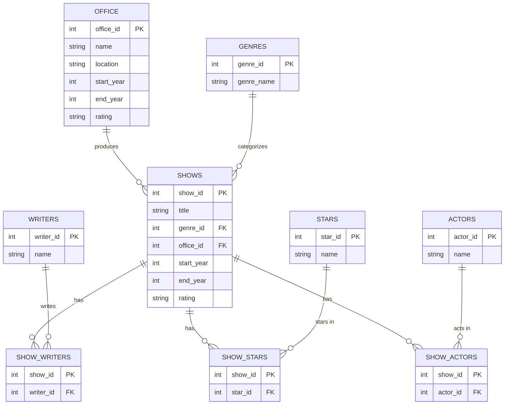

# Your Turn - A TV Show Catalog

```mermaid
erDiagram
    OFFICE ||--o{ SHOWS : "produces"
    GENRES ||--o{ SHOWS : "categorizes"
    SHOWS ||--o{ SHOW_WRITERS : "has"
    WRITERS ||--o{ SHOW_WRITERS : "writes"
    SHOWS ||--o{ SHOW_STARS : "has"
    STARS ||--o{ SHOW_STARS : "stars in"
    SHOWS ||--o{ SHOW_ACTORS : "has"
    ACTORS ||--o{ SHOW_ACTORS : "acts in"

    OFFICE {
        int office_id PK
        string name
        string location
        int start_year
        int end_year
        string rating
    }
    SHOWS {
        int show_id PK
        string title
        int genre_id FK
        int office_id FK
        int start_year
        int end_year
        string rating
    }
    GENRES {
        int genre_id PK
        string genre_name
    }
    WRITERS {
        int writer_id PK
        string name
    }
    SHOW_WRITERS {
        int show_id PK
        int writer_id FK
    }
    STARS {
        int star_id PK
        string name
    }
    SHOW_STARS {
        int show_id PK
        int star_id FK
    }
    ACTORS {
        int actor_id PK
        string name
    }
    SHOW_ACTORS {
        int show_id PK
        int actor_id FK
    }
```
